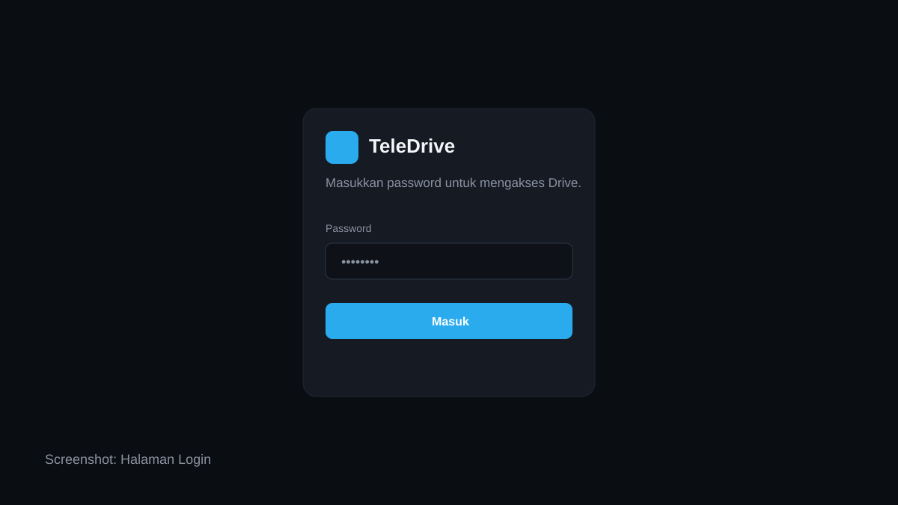
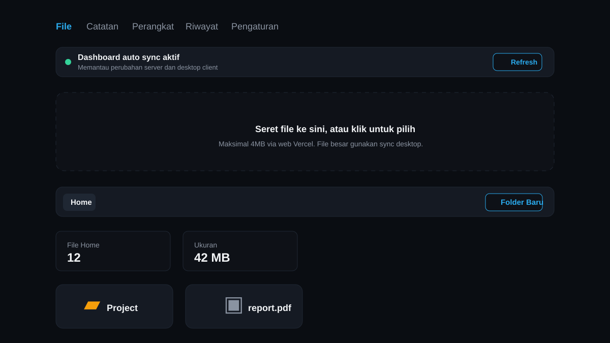
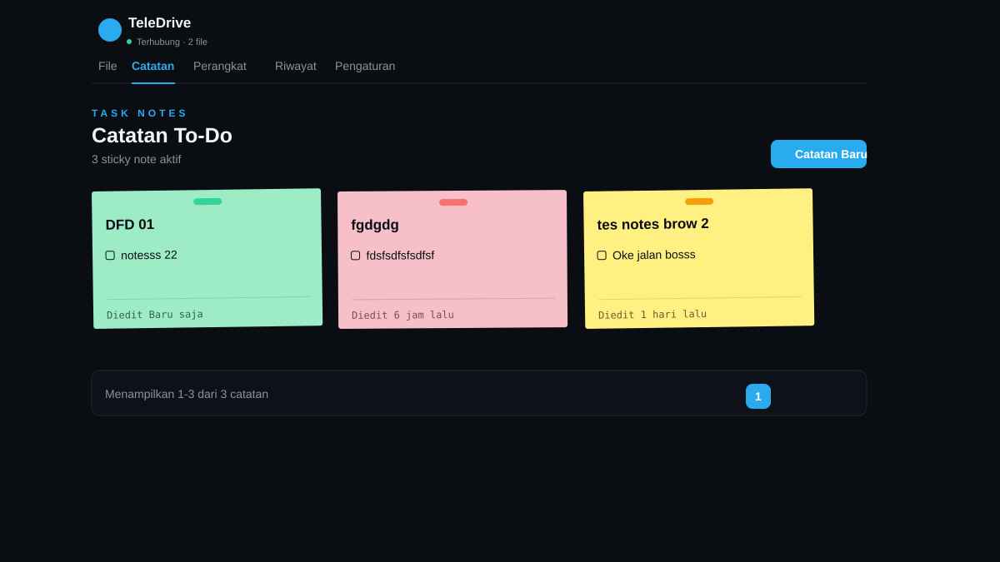
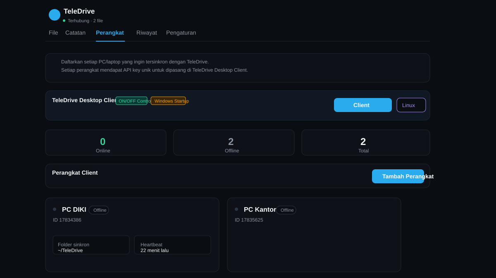
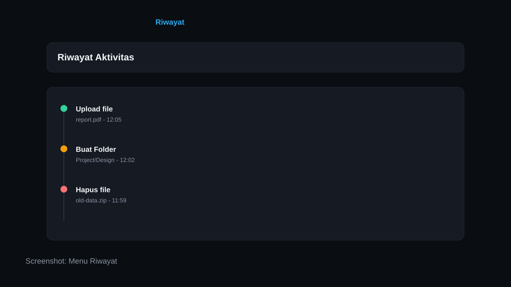
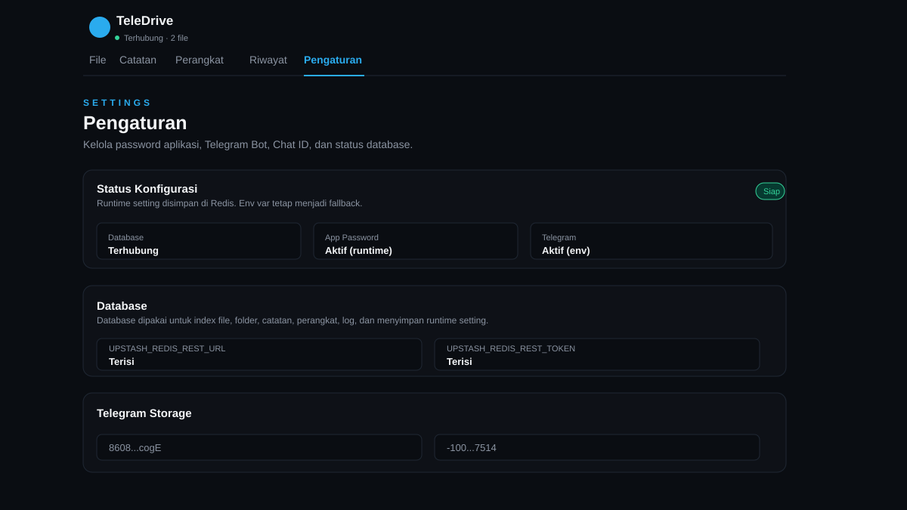
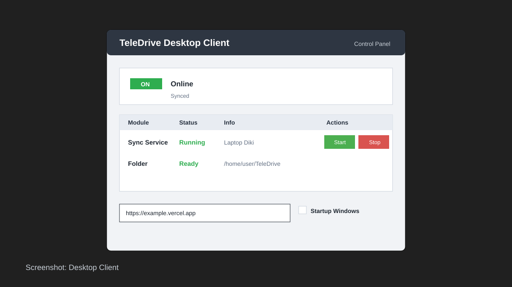

# TeleDrive Installation and Configuration Guide

Panduan ini menjelaskan alur setup TeleDrive dari nol sampai bisa dipakai oleh banyak perangkat/user.

## 1. Gambaran Sistem

TeleDrive terdiri dari 4 bagian:

1. **Server Web**
   Aplikasi Next.js yang di-deploy ke Vercel. Server ini menampilkan dashboard file, folder, catatan, perangkat, riwayat, dan pengaturan.

2. **Telegram Storage**
   File fisik disimpan sebagai dokumen di Telegram group/channel melalui Telegram Bot API.

3. **Redis Database**
   Upstash Redis menyimpan index file, folder, catatan, perangkat, API key client, log, dan runtime settings.

4. **Desktop Client**
   Aplikasi Python GUI yang dipasang di PC/laptop user. Client ini menyinkronkan folder lokal dengan server dan Telegram.

## Screenshot Menu

### Login



### File Dashboard



### Catatan



### Perangkat



### Riwayat



### Pengaturan



### Desktop Client



## 2. Mode Multi User

TeleDrive saat ini cocok untuk:

- 1 owner/admin dengan banyak perangkat.
- 1 tim kecil yang memakai 1 dashboard bersama.
- Banyak user yang masing-masing punya deployment sendiri.

Jika ingin benar-benar multi-tenant seperti SaaS publik, setiap user punya akun, storage, dan database terpisah, perlu pengembangan tambahan. Versi saat ini memakai 1 App Password, 1 Telegram storage, dan 1 Redis database per deployment.

Rekomendasi untuk banyak user:

- **Model pribadi:** setiap user fork/deploy project sendiri.
- **Model tim:** satu admin deploy server, lalu admin membuat perangkat untuk tiap PC/laptop anggota.

## 3. Prasyarat Admin

Admin perlu menyiapkan:

- Akun GitHub.
- Akun Vercel.
- Akun Upstash Redis.
- Akun Telegram.
- Bot Telegram dari BotFather.
- Group/channel Telegram untuk storage.

## 4. Setup Telegram Storage

1. Buka Telegram dan cari **BotFather**.
2. Jalankan `/newbot`.
3. Ikuti instruksi sampai mendapat token bot, contoh:

   ```text
   123456789:ABCDEF_xxxxxxxxxxxxxxxxx
   ```

4. Buat group atau channel Telegram khusus storage, misalnya:

   ```text
   TeleDrive Storage
   ```

5. Tambahkan bot ke group/channel tersebut.
6. Jadikan bot sebagai admin jika memakai channel.
7. Cari `chat_id` group/channel.

Cara paling mudah mendapatkan `chat_id`:

1. Kirim pesan atau file kecil ke group/channel.
2. Buka di browser:

   ```text
   https://api.telegram.org/botTOKEN_BOT/getUpdates
   ```

3. Cari bagian:

   ```json
   "chat": { "id": -100xxxxxxxxxx }
   ```

4. Simpan nilai `id` tersebut sebagai `TELEGRAM_CHAT_ID`.

## 5. Setup Redis Database

1. Buka Upstash.
2. Buat database Redis baru.
3. Ambil nilai REST API:

   ```text
   UPSTASH_REDIS_REST_URL
   UPSTASH_REDIS_REST_TOKEN
   ```

Database ini wajib ada karena dipakai untuk index file, folder, perangkat, pengaturan, dan log.

## 6. Deploy Server ke Vercel

1. Fork atau upload project ini ke GitHub.
2. Buka Vercel.
3. Pilih **Add New Project**.
4. Import repository TeleDrive.
5. Tambahkan Environment Variables:

   ```text
   UPSTASH_REDIS_REST_URL=...
   UPSTASH_REDIS_REST_TOKEN=...
   APP_PASSWORD=password_admin_awal
   ```

Opsional lewat environment variable:

```text
TELEGRAM_BOT_TOKEN=...
TELEGRAM_CHAT_ID=...
```

Telegram token dan chat id juga bisa diisi dari halaman **Pengaturan** setelah database aktif.

6. Klik **Deploy**.
7. Setelah selesai, buka URL Vercel.

## 7. Konfigurasi Pertama di Dashboard

1. Buka URL Vercel.
2. Login memakai `APP_PASSWORD`.
3. Masuk menu **Pengaturan**.
4. Pastikan status Database terhubung.
5. Isi atau update:

   - App Password
   - Token Bot Telegram
   - Chat ID Telegram

6. Klik **Simpan Pengaturan**.
7. Buka menu **File** dan coba upload file kecil untuk tes.

## 8. Menambah Perangkat/User

Admin membuat API key untuk setiap PC/laptop:

1. Buka menu **Perangkat**.
2. Klik **Tambah Perangkat**.
3. Isi nama perangkat, contoh:

   ```text
   Laptop Diki
   PC Kantor
   ```

4. Isi folder lokal default, contoh:

   ```text
   ~/TeleDrive
   ```

5. Klik **Daftarkan Perangkat**.
6. Copy API key yang dibuat.

API key ini dipakai oleh desktop client agar perangkat bisa sync tanpa memakai password admin.

## 9. Install Desktop Client untuk User

### Windows

1. Buka menu **Perangkat**.
2. Klik **Client**.
3. Jalankan file yang terunduh.
4. Isi:

   - Server URL: URL Vercel TeleDrive.
   - API Key Perangkat: key dari menu Perangkat.
   - Folder lokal: folder sync di PC.

5. Klik **ON** atau **Start**.
6. Jika ingin otomatis jalan saat Windows restart, centang **Startup Windows**.

### Linux

1. Buka menu **Perangkat**.
2. Klik **Linux All-in-One**.
3. Izinkan file agar bisa dijalankan sebagai program.
4. Jalankan file tersebut.
5. Jika Python/tkinter/venv belum tersedia, installer akan menawarkan pemasangan driver pendukung.
6. Isi Server URL, API key, dan folder lokal.
7. Klik **ON** atau **Start**.

## 10. Alur Sync File dan Folder

### Dari local disk ke server

1. User membuat file di folder lokal.
2. Desktop client mendeteksi perubahan.
3. File diupload ke server.
4. Server mengirim file ke Telegram.
5. Redis menyimpan index file.
6. Dashboard auto-refresh dan menampilkan file baru.

### Dari server ke local disk

1. Admin/user upload file dari dashboard.
2. Server menyimpan file ke Telegram dan Redis.
3. Desktop client polling server.
4. File didownload ke folder lokal.

### Folder dan subfolder

1. Folder dibuat di local disk.
2. Desktop client membuat folder yang sama di server.
3. Folder dibuat di server.
4. Desktop client membuat folder yang sama di local disk.
5. Subfolder ikut disimpan sebagai path, contoh:

   ```text
   Project/Design/Logo
   ```

### Delete file/folder

1. File dihapus dari local disk.
2. Desktop client meminta server menghapus file.
3. Server menghapus pesan/file dari Telegram dan index Redis.

Jika folder dihapus dari server, desktop client akan menghapus folder lokal yang sesuai.

## 11. Struktur Data Telegram

Telegram hanya dipakai sebagai storage file. Telegram tidak punya folder asli seperti file manager.

TeleDrive menyimpan struktur folder di metadata file:

```text
folderPath=Project/Design
folderId=...
```

Caption Telegram dibuat rapi, sedangkan metadata JSON disimpan sebagai spoiler agar tidak mengganggu tampilan Telegram.

## 12. Operasional Harian

Admin:

1. Cek menu **File** untuk data.
2. Cek menu **Perangkat** untuk status online/offline client.
3. Cek menu **Riwayat** untuk audit upload/delete/sync.
4. Cek menu **Pengaturan** jika token/password perlu diganti.

User:

1. Pastikan desktop client status **ON**.
2. Simpan file di folder TeleDrive lokal.
3. Tunggu beberapa detik sampai dashboard server auto-refresh.

## 13. Troubleshooting

### Dashboard tidak menampilkan file baru

- Pastikan desktop client status ON.
- Pastikan API key perangkat benar.
- Pastikan Redis dan Telegram sudah dikonfigurasi.
- Klik tombol Refresh di dashboard.

### Desktop client error Telegram conflict

Jika muncul pesan seperti:

```text
Conflict: terminated by other getUpdates request
```

Itu konflik sementara dari Telegram API. Server sudah dibuat tetap mengembalikan data dari index, dan client akan retry otomatis.

### File internal ikut muncul

Desktop client mengabaikan file internal:

```text
.teledrive-state.json
.teledrive-folders.json
*.tdtmp
```

### Upload web gagal untuk file besar

Upload web di Vercel dibatasi sekitar 4MB. Untuk file lebih besar gunakan desktop client.

### Telegram Bot API limit

Telegram Bot API punya batas ukuran upload. Jika butuh file sangat besar, perlu backend storage lain atau mode non-Vercel.

## 14. Checklist Deploy Baru

- [ ] Repo sudah masuk GitHub.
- [ ] Project sudah dibuat di Vercel.
- [ ] Redis Upstash sudah dibuat.
- [ ] `UPSTASH_REDIS_REST_URL` sudah diisi.
- [ ] `UPSTASH_REDIS_REST_TOKEN` sudah diisi.
- [ ] `APP_PASSWORD` sudah diisi.
- [ ] Bot Telegram sudah dibuat.
- [ ] Bot sudah masuk group/channel storage.
- [ ] Telegram token dan chat id sudah disimpan.
- [ ] Login dashboard berhasil.
- [ ] Upload file kecil berhasil.
- [ ] Perangkat pertama sudah dibuat.
- [ ] Desktop client berhasil ON.
